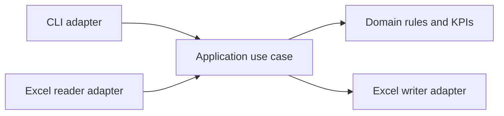

# MVP Architecture

## 1. Architecture decision

The MVP adopts a **pragmatic hexagonal architecture** for a Python data-processing application.

The objective is to keep ticket validation, SLA rules, and KPI calculations independent from Excel input/output details. This allows the same application logic to be reused later by a command-line interface, Flask API, scheduled job, or AI reporting workflow.

This is intentionally smaller than a full enterprise distributed architecture. The project uses the boundaries that add concrete value to maintainability, testing, and future evolution.

## 2. Architectural principles

- Business rules are the center of the application.
- Application orchestration does not implement business rules.
- Excel and future external systems are adapters.
- Dependencies point toward the application core.
- Structural errors and record-level rejections are handled differently.
- Business results are deterministic for the same input and `report_datetime`.
- Every module has one explicit responsibility.
- Unit tests do not require Excel files.
- Integration tests verify the real Excel boundary.

## 3. Logical architecture



## 4. Layers and responsibilities

### 4.1 Domain

The domain contains the approved ticket-reporting language and deterministic business behavior.

Responsibilities:

- supported ticket statuses and priorities;
- record-validation rules;
- backlog and completion classification;
- elapsed-time calculation;
- SLA classification;
- KPI formulas.

Constraints:

- must not import Excel-specific libraries;
- must not know file paths, worksheet formatting, Flask, or AI services;
- may use Pandas for clear vectorized tabular transformations;
- must be testable using in-memory DataFrames.

### 4.2 Application

The application layer implements the `process_ticket_report` use case.

Responsibilities:

- receive input and output parameters;
- invoke ports and domain services in the correct sequence;
- split valid and rejected results;
- coordinate KPI calculation;
- produce a processing result and audit record;
- control transaction-like pipeline success or failure.

Constraints:

- must not format Excel cells;
- must not duplicate domain formulas;
- must not depend on a concrete reader or writer implementation.

### 4.3 Ports

Ports define the capabilities required by the application core.

Initial ports:

- `WorkbookReader`: loads ticket data from a source;
- `ReportWriter`: writes processed results to a destination.

These contracts allow Excel adapters to be replaced or complemented later without changing domain rules.

### 4.4 Infrastructure adapters

Infrastructure contains technology-specific implementations.

Initial adapters:

- Pandas/OpenPyXL Excel reader;
- Pandas/OpenPyXL Excel report writer;
- filesystem path handling;
- runtime logging configuration.

Future adapters may include:

- REST request/response;
- database persistence;
- cloud object storage;
- AI management-commentary service.

### 4.5 Interface

The first interface is a small command-line entry point.

Responsibilities:

- accept the input path, output path, and `report_datetime`;
- validate command arguments;
- call the application use case;
- return an appropriate process exit code;
- display a concise processing result.

The interface must not contain data transformations or KPI formulas.

## 5. Processing flow

1. The interface receives execution parameters.
2. The application calls the workbook-reader port.
3. The Excel adapter loads the `Tickets` worksheet.
4. Schema validation verifies required columns.
5. Record validation produces auditable rejection reasons.
6. Valid and rejected records are separated.
7. Domain rules enrich valid tickets with backlog and SLA fields.
8. The KPI engine calculates overall and segmented metrics.
9. The application builds run-audit information.
10. The report-writer port creates the output workbook.
11. The application returns a structured processing result.

## 6. Error-handling boundaries

### Fatal processing errors

These stop the pipeline:

- input file does not exist or cannot be read;
- unsupported file type;
- required worksheet is missing;
- one or more required columns are missing;
- output file cannot be written;
- unexpected internal exception.

Fatal errors must be logged and returned through a clear application-level error.

### Record-level validation errors

These do not stop the pipeline:

- missing or duplicated ticket identifier;
- invalid or inconsistent dates;
- invalid status or priority;
- missing team;
- invalid SLA target;
- status/closure inconsistency.

These records are quarantined in `Rejected_Records` and excluded from business KPIs.

## 7. Proposed repository structure

```text
enterprise-excel-reporting-ai-platform/
├── src/
│   └── ticket_reporting/
│       ├── domain/
│       │   ├── policies.py
│       │   ├── validation.py
│       │   ├── ticket_rules.py
│       │   └── kpis.py
│       ├── application/
│       │   ├── process_report.py
│       │   └── results.py
│       ├── ports/
│       │   ├── workbook_reader.py
│       │   └── report_writer.py
│       ├── infrastructure/
│       │   ├── excel_reader.py
│       │   ├── excel_writer.py
│       │   └── logging_config.py
│       └── interfaces/
│           └── cli.py
├── tests/
│   ├── unit/
│   │   ├── domain/
│   │   └── application/
│   ├── integration/
│   └── fixtures/
├── examples/
│   ├── input/
│   └── output/
├── docs/
│   └── adr/
├── pyproject.toml
├── README.md
├── LICENSE
└── .gitignore
```

Empty modules and folders will not be created until required by an implementation increment.

## 8. Dependency rules

- `domain` does not import from application, ports, infrastructure, or interfaces.
- `application` may import domain and ports.
- `ports` define abstractions and must not import infrastructure.
- `infrastructure` implements ports and may import third-party I/O libraries.
- `interfaces` call the application layer.
- Flask and AI integrations must enter through new adapters, not through domain changes.

## 9. Testing strategy

### Unit tests

- validation rules;
- duplicate handling;
- backlog classification;
- elapsed-time calculations;
- SLA boundary conditions;
- KPI formulas;
- application orchestration with fake reader and writer ports.

### Integration tests

- reading the synthetic Excel workbook;
- handling missing worksheets and columns;
- producing every required output worksheet;
- reconciling audit totals;
- validating exported values.

## 10. Configuration policy

Not every business rule is configurable.

Stable domain concepts, such as allowed statuses and backlog classification, are versioned in code and tests. Environment-specific values, paths, and runtime settings may be externalized when a concrete need emerges.

This prevents hidden configuration from changing business meaning without code review.

## 11. Architecture evolution

The MVP remains a local batch application. Future increments can add:

- Flask as an inbound adapter;
- a database or object store as outbound adapters;
- scheduled execution;
- an AI reporting adapter that consumes deterministic KPI results;
- additional workbook or API input adapters.

The domain and application layers should remain stable during these changes.

## 12. References

- AWS Prescriptive Guidance, *Hexagonal architecture pattern*: https://docs.aws.amazon.com/prescriptive-guidance/latest/cloud-design-patterns/hexagonal-architecture.html
- Python Packaging User Guide, *src layout vs flat layout*: https://packaging.python.org/en/latest/discussions/src-layout-vs-flat-layout/
